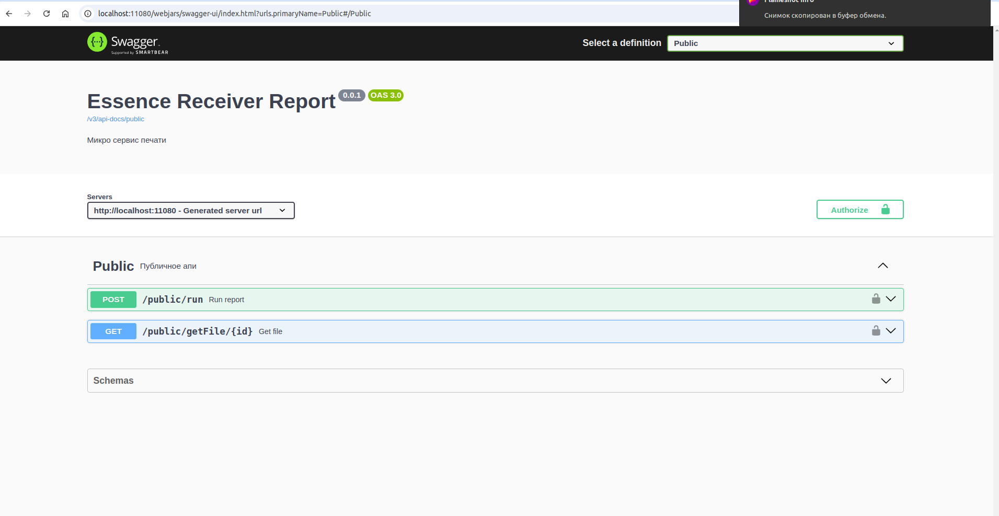

## Отчетный сервер
### Устанновка
[Установка БД](db/README.md)

Правим настройки в example/application.yaml
### Сборка и запуск
```bash
./gradlew clean build
cd build/distributions; \
tar -xvf essence-report-boot-*.tar; \
cd $(find . -type d -name 'essence-report-boot*')
./bin/essence-report --spring.config.location=classpath:/,file:../../../example/application.yaml
```

### Сборка и запуск Docker
```bash
docker build --tag essence-report .
docker run --rm -it --name essence-report -p 11080:8080 -v ./example:/conf --env spring.config.location=classpath:/,file:/conf/application.yaml essence-report:latest
```
[Swagger](http://localhost:11080/webjars/swagger-ui/index.html?urls.primaryName=Public#/Public)
